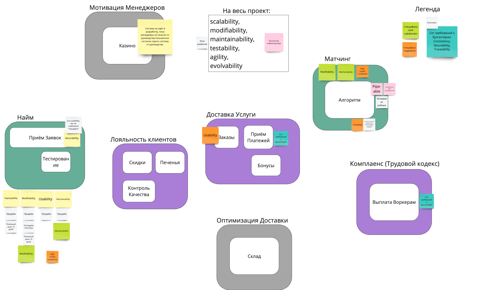
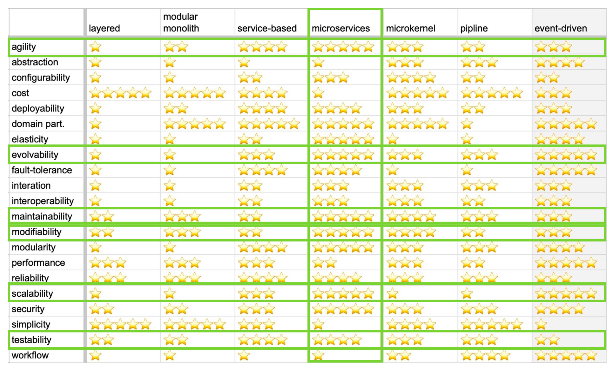

# Выбор архитектурного стиля

## Status: Accepted

## Context

Основываясь на требованиях и консёрнах стейкхолдеров, было определено, что  необходимо реализовать систему из 12 боундед-контекстов, каждый из которых имеет свой набор характеристик

- общее внимание на scalability, modifiability, maintainability, testability, agility, evolvability, полученные из этапа развития бизнеса
- high model complexity, а значит, modifiability и maintainability, для core-поддоменов Матчинг и Найм
- securability для Приёма заявок: будет DDoS
- общие для Тестирования и Приёма заявок: deployability, modifiability, usability, maintainability (мы не только используем, но продаём это как продукт)
- для Тестирования: релизный цикл <5 дней требует дополнительного modifiability и deployability
- для Тестирования: необходимость тестировать гипотезы требует дополнительного modifiability
- общие для Тестирования и Приёма заявок: modifiability, maintainability как специфика code-subdomain
- высокий usability со стороны Клиента для Заказов
- Приём платежей, Выплата воркерам, Бонусы должны обладать высокими consistency, securability, traceability для комплаенса
- Матчинг требует высокого modifiability и maintainability, так как это core-поддомен
- Матчинг нужно запускать быстро в ответ на запросы Клиента, поэтому требуется высокий scalability

Кроме характеристик, в системе есть следующие ограничения:

- у финансистов есть комплаенс, который необходимо соблюдать
- алгоритм Матчинга держится в секрете Учёными
- меньшее внимание к цене инфраструктуры, продиктованное доступностью инфраструктурных специалистов материнской компании

## Decision: микросервисный стиль

Через общие требования к системе, общая архитектура выбрана microservices

В дополнении к этому, некоторым модулям нужны собственные базы:

- Приём заявок - изолировать сервис от других из-за DDoS
- Комплаенс / Приём платежей - комплаенс с законами

## Сompliance

Так как нет вариантов автоматической проверки реализации архитектурного стиля, то вся проверка будет делаться вручную посредством изучения проектной документации, кода и автоматически генерируемой карты сервисов, основанной на инструментах трассировки.